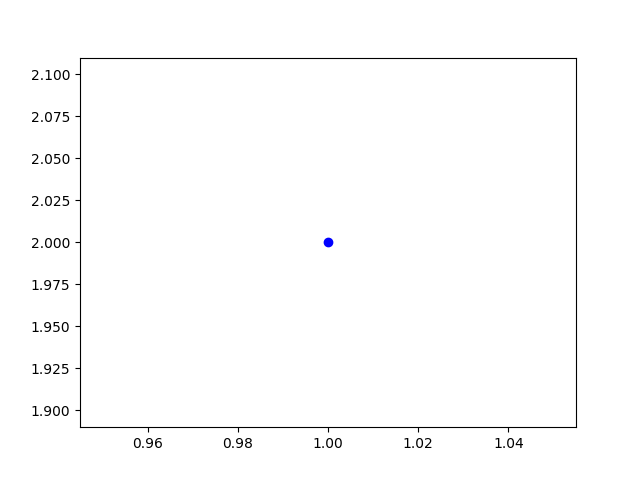
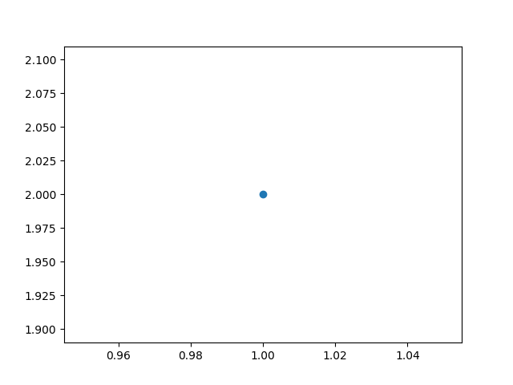
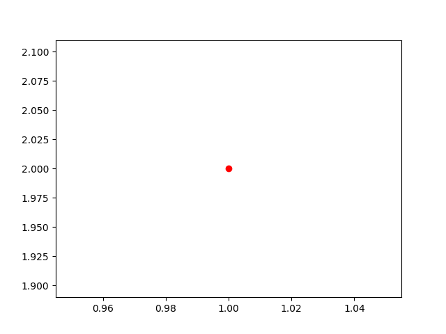
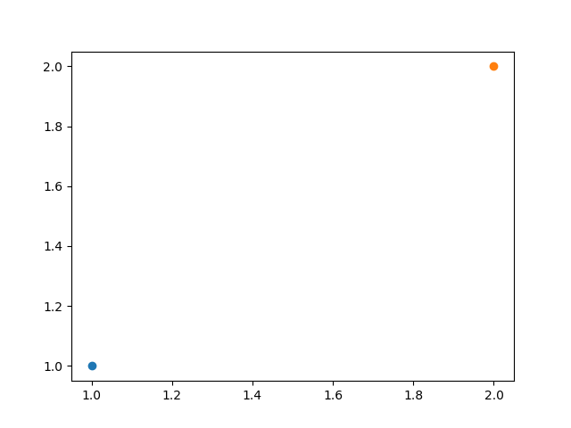
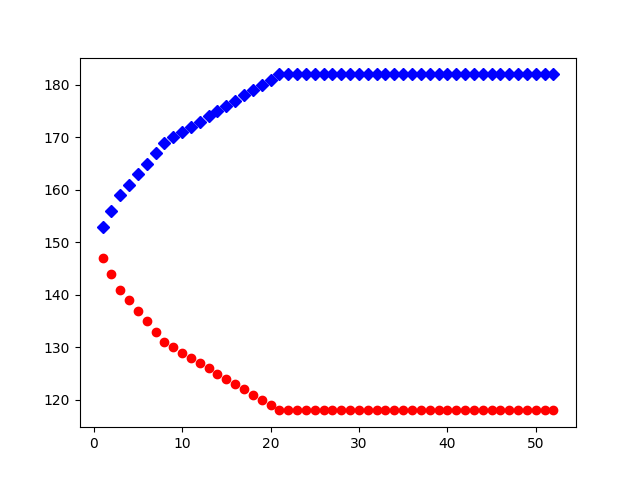
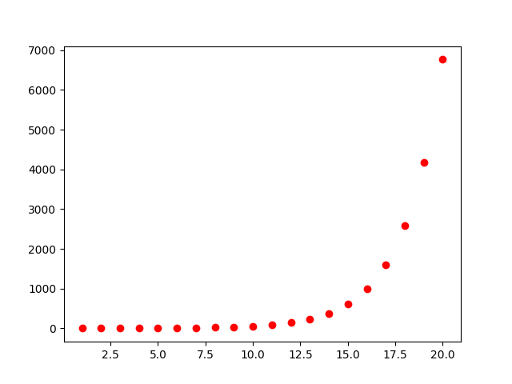

```{r, echo=FALSE}
setwd("~/GitHub/MATLAB")
knitr::opts_chunk$set(
  comment=NA,
  engine.path = list(
    python = '/usr/local/bin/python3',
    octave = '/Applications/Octave.app/Contents/Resources/usr/Cellar/octave/4.0.3/bin/octave'
  )
)

library(reticulate)

setwd("~/GitHub/MATLAB")
```

*Physical Modeling in MATLAB* by Allen B. Downey 

Version 1.1.8

## 3.1 Updating variables

In Exercise 2.3, you might have been tempted to write something like

```
a = a - 0.05*a + 0.03*b
b = b + 0.05*a - 0.03*b
```

But that would be wrong, so very wrong. Why? The problem is that the first line changes the value of a, so when the second line runs, it gets the old value of b and the new value of a. As a result, the change in a is not always the same as the change in b, which violates the principle of Conversation of Cars!

One solution is to use temporary variables anew and bnew:

```
anew = a - 0.05*a + 0.03*b
bnew = b + 0.05*a - 0.03*b
a = anew
b = bnew
```

This has the effect of updating the variables “simultaneously;” that is, it reads both old values before writing either new value.

The following is an alternative solution that has the added advantage of simplifying the computation:

```
atob = 0.05*a - 0.03*b
a = a - atob
b = b + atob
```

It is easy to look at this code and confirm that it obeys Conversation of Cars. Even if the value of atob is wrong, at least the total number of cars is right. And that brings us to the Seventh Theorem of Debugging:

    The best way to avoid a bug is to make it impossible.

In this case, removing redundancy also eliminates the opportunity for a bug.

## 3.2 Kinds of error

There are four kinds of error:

**Syntax error:** You have written a MATLAB command that cannot execute because it violates one of the rules of syntax. For example, you can’t have two operands in a row without an operator, so pi r^2 contains a syntax error. When MATLAB finds a syntax error, it prints an error message and stops running your program.

**Runtime error:** Your program starts running, but something goes wrong along the way. For example, if you try to access a variable that doesn’t exist, that’s a runtime error. When MATLAB detects the problem, it prints an error message and stops.

**Logical error:** Your program runs without generating any error messages, but it doesn’t do the right thing. The problem in the previous section, where we changed the value of a before reading the old value, is a logical error.

**Numerical error:** Most computations in MATLAB are only approximately right. Most of the time the errors are small enough that we don’t care, but in some cases the roundoff errors are a problem.

Syntax errors are usually the easiest. Sometimes the error messages are confusing, but MATLAB can usually tell you where the error is, at least roughly.

Run time errors are harder because, as I mentioned before, MATLAB can tell you where it detected the problem, but not what caused it.

Logical errors are hard because MATLAB can’t help at all. Only you know what the program is supposed to do, so only you can check it. From MATLAB’s point of view, there’s nothing wrong with the program; the bug is in your head!

Numerical errors can be tricky because it’s not clear whether the problem is your fault. For most simple computations, MATLAB produces the floating-point value that is closest to the exact solution, which means that the first 15 significant digits should be correct. But some computations are ill-conditioned, which means that even if your program is correct, the roundoff errors accumulate and the number of correct digits can be smaller. Sometimes MATLAB can warn you that this is happening, but not always! Precision (the number of digits in the answer) does not imply accuracy (the number of digits that are right).

## 3.3 Absolute and relative error

There are two ways of thinking about numerical errors, called absolute and relative.

An absolute error is just the difference between the correct value and the approximation. We usually write the magnitude of the error, ignoring its sign, because it doesn’t matter whether the approximation is too high or too low.

For example, we might want to estimate 9! using the formula sqrt(18*π)*(9/e)^9. The exact answer is 9·8·7·6·5·4·3·2·1 = 362,880. The approximation is 359,536.87. The absolute error is 3,343.13.

At first glance, that sounds like a lot — we’re off by three thousand — but it is worth taking into account the size of the thing we are estimating. For example, $3000 matters a lot if we are talking about my annual salary, but not at all if we are talking about the national debt.

A natural way to handle this problem is to use relative error, which is the error expressed as a fraction (or percentage) of the exact value. In this case, we would divide the error by 362,880, yielding 0.00921, which is just less than 1%. For many purposes, being off by 1% is good enough.

## 3.4 for loops

A loop is a part of a program that executes repeatedly; a for loop is the kind of loop that uses the for statement.

The simplest use of a for loop is to execute one or more lines a fixed number of times. For example, in the last chapter we wrote a script named car update that simulates one week in the life of a rental car company. To simulate an entire year, we have to run it 52 times:

```
for i=1:52
    car_update
end
```

*Octave code*

```{octave}
function [A, B] = car_update(A, B)
    aRate = 0.05; % Rate of cars in Albany dropped off in Boston
    bRate = 0.03; % Rate of cars in Boston dropped off in Albany

    atob = round(aRate*A - bRate*B); % Number of cars moved from Albany to Boston

    A = A - atob; % Number of cars remaining in Albany
    B = B + atob; % Number of cars remaining in Boston
    display([A B])
end

a = 150;
b = 150;

for i = 1:52
    [a, b] = car_update(a, b);
end
```

*R code*

```{r}
car_update <- function(A, B) {
  aRate <- 0.05 # Rate of cars in Albany dropped off in Boston
  bRate <- 0.03 # Rate of cars in Boston dropped off in Albany

  atob <- round(aRate*A - bRate*B) # Number of cars moved from Albany to Boston

  A <- A - atob # Number of cars remaining in Albany
  B <- B + atob # Number of cars remaining in Boston
  cat(A, B, "\n")
  return(c(A, B))
}

a <- 150
b <- 150
for(i in 1:52) {
  ab <- car_update(a, b)
  a <- ab[1]
  b <- ab[2]
}
```

*Python code*

```{python}
def car_update(A, B):

    aRate = 0.05 # Rate of cars in Albany dropped off in Boston
    bRate = 0.03 # Rate of cars in Boston dropped off in Albany

    atob = round(aRate*A - bRate*B) # Number of cars moved from Albany to Boston

    A = A - atob # Number of cars remaining in Albany
    B = B + atob # Number of cars remaining in Boston

    print(A, B)
    return(A, B)

a = 150
b = 150
for i in range(0, 52):
    a, b = car_update(a, b)
```

The first line looks like an assignment statement, and it is like an assignment statement, except that it runs more than once. The first time it runs, it creates the variable i and assigns it the value 1. The second time, i gets the value 2, and so on, up to 52.

The colon operator, “:”, specifies a range of integers. In the spirit of unit testing, you can create a range at the prompt:

*Octave code*

```{octave}
1:5
```

*R code*

```{r}
1:5
```

*Python code*

```{python}
ans = list(range(1, 6))
print(ans)
```

The variable you use in the for statement is called the loop variable. It is a common convention to use the names i, j and k as loop variables.

The statements inside the loop are called the body. By convention, they are indented to show that they are inside the loop, but the indentation does not actually affect the execution of the program. The end of the loop is officially marked by the end statement.

To see the loop in action you can run a loop that displays the loop variable:

*Octave code*

```{octave}
for i = 1:5
    i
end
```

*R code*

```{r}
for(i in 1:5) {
  cat(i, "\n")
}
```

*Python code*

```{python}
for i in range(1, 6):
    print(i)
```

As this example shows, you can run a for loop from the command line, but it’s much more common to put it in a script.

**Exercise 3.1** Create a script named "car_loop"" that uses a for loop to run car update 52 times. Remember that before you run car update, you have to assign values to a and b. For this exercise, start with the values a = 150 and b = 150.

If everything goes smoothly, your script will display a long stream of numbers on the screen. But it is probably too long to fit, and even if it fit, it would be hard to interpret. A graph would be much better!

*Octave code*

```{octave}
function [A, B] = car_update(A, B)
    aRate = 0.05; % Rate of cars in Albany dropped off in Boston
    bRate = 0.03; % Rate of cars in Boston dropped off in Albany

    atob = round(aRate*A - bRate*B); % Number of cars moved from Albany to Boston

    A = A - atob; % Number of cars remaining in Albany
    B = B + atob; % Number of cars remaining in Boston
    display([A B])
end

function ans = car_loop(A, B)
    % Use a for loop to run car_update 52 times. 
    for i = 1:52
        [A, B] = car_update(A, B);
    end
end

a = 150; % initial number of cars in Albany
b = 150; % initial number of cars in Boston

car_loop(a, b)
```

*R code*

```{r, results="hold"}
car_loop <- function(A, B) {
  # Use a for loop to run "car_update.R" 52 times

  for(i in 1:52) {
    AB <- car_update(A, B)
    A  <- AB[1]
    B  <- AB[2]
  }
}

a <- 150 # initial number of cars in Albany
b <- 150 # initial number of cars in Boston

car_loop(a, b)
```

*Python code*

```{python}
def car_update(A, B):

    aRate = 0.05 # Rate of cars in Albany dropped off in Boston
    bRate = 0.03 # Rate of cars in Boston dropped off in Albany

    atob = round(aRate*A - bRate*B) # Number of cars moved from Albany to Boston

    A = A - atob # Number of cars remaining in Albany
    B = B + atob # Number of cars remaining in Boston

    print(A, B)
    return(A, B)
    
def car_loop(A, B):
    # Use a for loop to run car_update 52 times.

    for i in range(1, 53):
        A, B = car_update(A, B)

a = 150 # initial number of cars in Albany
b = 150 # initial number of cars in Boston
car_loop(a, b)
```

## 3.5 plotting

plot is a versatile function for plotting points and lines on a two-dimensional graph. Unfortunately, it is so versatile that it can be hard to use (and hard to read the documentation!). We will start simple and work our way up.

To plot a single point, type

*Octave code*

```{octave}
plot(1, 2)
```

*R code*

```{r}
par(pty = "s")
plot(1, 2, xlab = "", ylab = "")
```

*Python code*

```{python}
import pylab as pl

pl.plot(1, 2, 'bo')
#pl.show()
pl.savefig("fig-3-1.png")
```



A Figure Window should appear with a graph and a single, blue dot at x position 1 and y position 2. To make the dot more visible, you can specify a different shape:

*Octave code*

```{octave}
plot(1, 2, 'o')
```

*R code*

```{r}
par(pty = "s")
plot(1, 2, pch = 16, xlab = "", ylab = "")
```

*Python code*

```{python}
import pylab as pl

pl.plot(1, 2, 'o')
#pl.show()
pl.savefig("fig-3-2.png")
```



The letter in single quotes is a string that specifies how the point should be plotted. You can also specify the color:

*Octave code*

```{octave}
plot(1, 2, 'ro')
```

*R code*

```{r}
par(pty = "s")
plot(1, 2, pch = 1, col = "red", xlab = "", ylab = "")
```

*Python code*

```{python}
import pylab as pl

pl.plot(1, 2, 'ro')
#pl.show()
pl.savefig("fig-3-3.png")
```



r stands for red; the other colors include green, blue, cyan, magenta, yellow and black. Other shapes include “+”, “*”, “x”, “s” (for square), “d” (for diamond), and “^” (for a triangle).

When you use plot this way, it can only plot one point at a time. If you run plot again, it clears the figure before making the new plot. The hold command lets you override that behavior. hold on tells MATLAB not to clear the figure when it makes a new plot; hold off returns to the default behavior.

Try this:

*Octave code*

```{octave}
hold on
plot(1, 1, 'o')
plot(2, 2, 'o')
hold off
```

*R code*

```{r}
par(pty = "s")
plot(1, 1, pch = 1, xlim = c(1, 2), ylim = c(1, 2), xlab = "", ylab = "")
points(2, 2, pch = 1)
```

*Python code*

```{python}
import pylab as pl

pl.plot(1, 1, 'o')
pl.plot(2, 2, 'o')
#pl.show()
pl.savefig("fig-3-4.png")
```



You should see a figure with two points. MATLAB scales the plot automatically so that the axes run from the lowest value in the plot to the highest. So in this example the points are plotted in the corners.

**Exercise 3.2** Modify "car_loop"" so that each time through the loop it plots the value of a versus the value of i.

Once you get that working, modify it so it plots the values of a with red circles and the values of b with blue diamonds.

One more thing: if you use hold on to prevent MATLAB from clearing the figure, you might want to clear the figure yourself, from time to time, with the command clf.

*Octave code*

```{octave}
function [A, B] = car_update(A, B)
    aRate = 0.05; % Rate of cars in Albany dropped off in Boston
    bRate = 0.03; % Rate of cars in Boston dropped off in Albany

    atob = round(aRate*A - bRate*B); % Number of cars moved from Albany to Boston

    A = A - atob; % Number of cars remaining in Albany
    B = B + atob; % Number of cars remaining in Boston
    display([A B])
end

function ans = car_loop(A, B)
    % Use a for loop to run car_update 52 times. 
    for i = 1:52
        [A, B] = car_update(A, B);
        plot(i, A, "ro");
        plot(i, B, "bd");
    end
end

a = 150; % initial number of cars in Albany
b = 150; % initial number of cars in Boston

hold on
car_loop(a, b);
hold off
```

*R code*

```{r}
car_update <- function(A, B) {
  aRate <- 0.05 # Rate of cars in Albany dropped off in Boston
  bRate <- 0.03 # Rate of cars in Boston dropped off in Albany

  atob <- round(aRate*A - bRate*B) # Number of cars moved from Albany to Boston

  A <- A - atob # Number of cars remaining in Albany
  B <- B + atob # Number of cars remaining in Boston
  #cat(A, B, "\n")
  return(c(A, B))
}

car_loop <- function(A, B) {
  # Use a for loop to run "car_update" 52 times

  for(i in 1:52) {
    AB <- car_update(A, B)
    A  <- AB[1]
    B  <- AB[2]
    points(i, A, col = "red" , pch =  1)
    points(i, B, col = "blue", pch = 18)
  }
}

a <- 150 # initial number of cars in Albany
b <- 150 # initial number of cars in Boston

plot(c(0, 52), c(100, 200), xlab = "Week", ylab = "Count", type = "n")
car_loop(a, b)
```

*Python code*

```{python}
import pylab as pl

def car_update(A, B):

    aRate = 0.05 # Rate of cars in Albany dropped off in Boston
    bRate = 0.03 # Rate of cars in Boston dropped off in Albany

    atob = round(aRate*A - bRate*B) # Number of cars moved from Albany to Boston

    A = A - atob # Number of cars remaining in Albany
    B = B + atob # Number of cars remaining in Boston

    #print(A, B)
    return(A, B)
    
def car_loop(A, B):
    # Use a for loop to run car_update 52 times.

    for i in range(1, 53):
        A, B = car_update(A, B)
        pl.plot(i, A, 'ro')
        pl.plot(i, B, 'bD')

a = 150 # initial number of cars in Albany
b = 150 # initial number of cars in Boston
car_loop(a, b)

#pl.show()
pl.savefig("fig-3-5.png")
```



## 3.6 Sequences

In mathematics a sequence is a set of numbers that corresponds to the positive integers. The numbers in the sequence are called elements. In math notation, the elements are denoted with subscripts, so the first element of the series A is A[1], followed by A[2], and so on.

for loops are a natural way to compute the elements of a sequence. As an example, in a geometric sequence, each element is a constant multiple of the previous element. As a more specific example, let’s look at the sequence with A[1] = 1 and the ratio A[i + 1] = A[i]/2, for all i. In other words, each element is half as big as the one before it.

The following loop computes the first 10 elements of A:

*Octave code*

```{octave}
a = 1
for i = 2:10
    a = a/2
end
```

*R code*

```{r, results="hold"}
a <- 1
cat(a, "\n")
for(i in 2:10) {
  a <- a/2
  cat(a, "\n")
}
```

*Python code*

```{python}
a = 1.0
print(a)
for i in range(2, 11):
    a = a/2.0
    print(a)
```

Each time through the loop, we find the next value of a by dividing the previous value by 2. Notice that the loop range starts at 2 because the initial value of a corresponds to A[1], so the first time through the loop we are computing A[2].

Each time through the loop, we replace the previous element with the next, so at the end, a contains the 10th element. The other elements are displayed on the screen, but they are not saved in a variable. Later, we will see how to save all of the elements of a sequence in a vector.

This loop computes the sequence recurrently, which means that each element depends on the previous one. For this sequence it is also possible to compute the i-th element directly, as a function of i, without using the previous element. In math notation, A[i] = A[1]r^(i − 1).

**Exercise 3.3** Write a script named sequence that uses a loop to compute elements of A directly.

*Octave code*

```{octave}
a1 = 1;
r = 1/2;
for i = 2:10
    a = a1*r^(i - 1)
end
```

*R code*

```{r}
a1 <- 1
r <- 1/2
for(i in 2:10) {
  a <- a1*r^(i - 1)
  cat(a, "\n")
}
```

*Python code*

```{python}
a1 = 1.0
r = 1.0/2.0
for i in range(2, 11):
    a = a1*r**(i - 1)
    print(a)
```

## 3.7 Series

In mathematics, a series is the sum of the elements of a sequence. It’s a terrible name, because in common English, “sequence” and “series” mean pretty much the same thing, but in math, a sequence is a set of numbers, and a series is an expression (a sum) that has a single value. In math notation, a series is often written using the summation symbol "sum".

For example, the sum of the first 10 elements of A is

$\sum_{i=1}^{10}A_{i}$

A for loop is a natural way to compute the value of this series: 

*Octave code*

```{octave}
A1 = 1;
total = 0;
for i = 1:10
    a = A1 * 0.5^(i - 1);
    total = total + a;
end
ans = total
```

*R code*

```{r}
A1 <- 1
total <- 0
for(i in 1:10) {
  a <- A1*0.5^(i - 1)
  total <- total + a
}

total
```

*Python code*

```{python}
A1 = 1
total = 0
for i in range(1, 11):
    a = A1*0.5**(i - 1)
    total = total + a

print(total)
```

A1 is the first element of the sequence, so each time through the loop a is the i-th element.

The way we are using total is sometimes called an accumulator; that is, a variable that accumulates a result a little bit at a time. Before the loop we initialize it to 0. Each time through the loop we add in the i-th element. At the end of the loop total contains the sum of the elements. Since that’s the value we were looking for, we assign it to ans.

**Exercise 3.4** This example computes the terms of the series directly; as an exercise, write a script named series that computes the same sum by computing the elements recurrently. You will have to be careful about where you start and stop the loop.

*Octave code*

```{octave}
a = 1;
r = 1/2;
for i = 2:10
    a = a*r
end
```

*R code*

```{r}
a <- 1
r <- 1/2
for(i in 2:10) {
  a <- a*r
  cat(a, "\n")
}
```

*Python code*

```{python}
a = 1.0
r = 1.0/2.0
for i in range(2, 11):
    a = a*r
    print(a)
```

## 3.8 Generalization

As written, the previous example always adds up the first 10 elements of the sequence, but we might be curious to know what happens to total as we increase the number of terms in the series. If you have studied geometric series, you might know that this series converges on 2; that is, as the number of terms goes to infinity, the sum approaches 2 asymptotically.

To see if that’s true for our program, we could replace the constant, 10, with a variable named n:

```
A1 = 1;
total = 0;
for i=1:n
    a = A1 * 0.5^(i - 1);
    total = total + a;
end
ans = total
```

Now the script can compute any number of terms, with the precondition that you have to set n before you execute the script. Here’s how you could run it with different values of n:

*Octave code*

```{octave}
% modify script "series" from Exercise 3.4

function ans = series(n)
    A1 = 1;
    total = 0;
    for i = 1:n 
        a = A1 * 0.5^(i - 1);
        total = total + a;
    end
    ans = total
end

format long

series(10);
series(20);
series(30);
series(40);
```

*R code*

```{r, results="hold"}
# modify script "series" from Exercise 3.4

series <- function(N) {
  A1 <- 1
  total <- 0
  for(i in 1:N) { # instead of "for(i in 1:10)"
    a <- A1 * 0.5^(i - 1)
    total <- total + a
  }
  cat(total, "\n")
}

options(digits = 15) # instead of "format long" in MATLAB

series(10)
series(20)
series(30)
series(40)
```

*Python code*

```{python}
# modify script "series" from Exercise 3.4

def series(N):
    A1 = 1
    total = 0
    for i in range(1, N + 1): 
        a = A1*0.5**(i - 1)
        total = total + a
    print(total) # equivalent formating for "format long" in MATLAB?

series(10)
series(20)
series(30)
series(40)
```

It sure looks like it’s converging on 2.

Replacing a constant with a variable is called generalization. Instead of computing a fixed, specific number of terms, the new script is more general; it can compute any number of terms.

This is an important idea we will come back to when we talk about functions.

## 3.9 Glossary

**absolute error:** The difference between an approximation and an exact answer.

**relative error:** The difference between an approximation and an exact answer, expressed as a fraction or percentage of the exact answer.

**loop:** A part of a program that runs repeatedly.

**loop variable:** A variable, defined in a for statement, that gets assigned a different value each time through the loop.

**range:** The set of values assigned to the loop variable, often specified with the colon operator; for example 1:5.

**body:** The statements inside the for loop that are run repeatedly.

**sequence:** In mathematics, a set of numbers that correspond to the positive integers.

**element:** A member of the set of numbers in a sequence.

**recurrently:** A way of computing the next element of a sequence based on
previous elements.

**directly:** A way of computing an element in a sequence without using previous elements.

**series:** The sum of the elements in a sequence.

**accumulator:** A variable that is used to accumulate a result a little bit at a time.

**generalization:** A way to make a program more versatile, for example by replacing a specific value with a variable that can have any value.

## 3.10 Exercises

**Exercise 3.5** We have already seen the Fibonacci sequence, F, which is defined recurrently as

    F[i] = F[i − 1] + F[i − 2]

In order to get started, you have to specify the first two elements, but once you have those, you can compute the rest. The most common Fibonacci sequence starts with F[1] = 1 and F[2] = 1.

Write a script called fibonacci2 that uses a for loop to compute the first 10 elements of this Fibonacci sequence. As a postcondition, your script should assign the 10th element to ans.

Now generalize your script so that it computes the nth element for any value of n, with the precondition that you have to set n before you run the script. To keep things simple for now, you can assume that n is greater than 0.

Hint: you will have to use two variables to keep track of the previous two elements of the sequence. You might want to call them prev1 and prev2. Initially, prev1 = F1 and prev2 = F2. At the end of the loop, you will have to update prev1 and prev2; think carefully about the order of the updates!

- Computes the nth Fibonacci number.

- Precondition: you must assign a value to n before running this script.
    + Assume that n is greater than 2.

- Postcondition: assign the 10th element to ans.

*Octave code*

```{octave}
function ans = fibonacci2(n)
    prev1 = 1;
    prev2 = 1;

    total = 0;
    for i = 3:n
        total =  prev1 + prev2;
        prev2 = prev1;
        prev1 = total;
    end
  ans = total
end

fibonacci2(10);
```

*R code*

```{r}
fibonacci2 <- function(n) {

  prev1 <- 1
  prev2 <- 1

  total <- 0
  for(i in 3:n) {
    total <- prev1 + prev2
    prev2 <- prev1
    prev1 <- total
  }
  cat(total, "\n")
}

fibonacci2(10)
```

*Python code*

```{python}
def fibonacci2(n):

    prev1 = 1
    prev2 = 1
    total = 0
    
    for i in range (3, (n + 1)):
        total = prev1 + prev2
        prev2 = prev1
        prev1 = total
    print(total)

fibonacci2(10)
```

**Exercise 3.6** Write a script named fib plot that loops i through a range from 1 to 20, uses fibonacci2 to compute Fibonacci numbers, and plots F[i] for each i with a series of red circles.

*Octave code*

```{octave}
function ans = fibonacci2(n)
    prev1 = 1;
    prev2 = 1;

    total = 0;
    for i = 3:n
        total =  prev1 + prev2;
        prev2 = prev1;
        prev1 = total;
    end
  ans = total;
end

hold on

plot(1, 1, "ro"); % i = 1
plot(2, 1, "ro"); % i = 2

for i = 3:20
    ans = fibonacci2(i);
    display([i ans])
    plot(i, ans, "ro");
end

hold off
```

*R code*

```{r}
fibonacci2 <- function(n) {

  prev1 <- 1
  prev2 <- 1

  total <- 0
  for(i in 3:n) {
    total <- prev1 + prev2
    prev2 <- prev1
    prev1 <- total
  }
  total
}

plot(c(0, 20), c(0, 7000), xlab = "n", ylab = "Fibonacci Number", type = "n")

points(1, 1, col = "red", pch = 1); # n = 1, F1 = 1
points(2, 1, col = "red", pch = 1); # n = 2, F2 = 1

for(n in 3:20) {
  ans <- fibonacci2(n)
  #cat(n, ans, "\n")
  points(n, ans, col = "red", pch = 1);
}
```

*Python code*

```{python}
import pylab as pl

def fibonacci2(n):

    prev1 = 1
    prev2 = 1
    total = 0
    
    for i in range (3, (n + 1)):
        total = prev1 + prev2
        prev2 = prev1
        prev1 = total
    return(total)

pl.plot(1, 1, 'ro') # n = 1, F1 = 1
pl.plot(2, 1, 'ro') # n = 2, F2 = 1

for n in range(3, 21):
  ans = fibonacci2(n)
  #print(n, ans)
  pl.plot(n, ans, 'ro')

#pl.show()
pl.savefig("fig-3-6.png")
```

